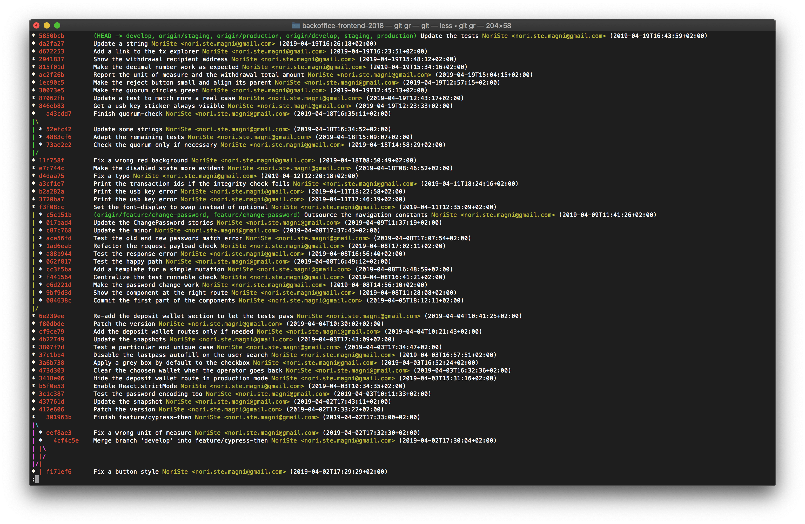

[Tommaso Allevi](https://github.com/allevo) gave me this useful Git log prettifier while coding the
[Cypress Wait Until plugin](https://github.com/NoriSte/cypress-wait-until) during an [Open Source
Saturday](https://www.meetup.com/it-IT/Open-Source-Saturday-Milano/).

```
git config --global alias.gr 'log --graph --full-history --all --color --tags --decorate --pretty=format:"%x1b[31m%h%x09%x1b[32m%d%x1b[0m%x20%s %x1b[33m%aN <%ae>%x1b[0m (%aI)"'
```

The log looks like this

